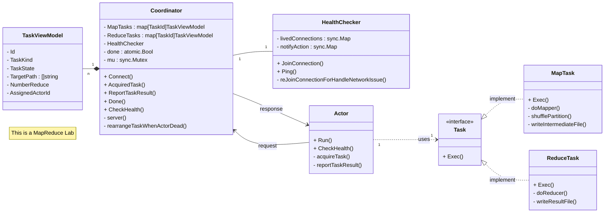

# 6.5840 Lab 1: MapReduce

<https://pdos.csail.mit.edu/6.824/labs/lab-mr.html>

## code design

[implement code](../mr)
- [Coordinator](../mr/coordinator.go#L41)
- [HealthChecker](../mr/health.go#L31)
- [Worker (NewActor)](../mr/worker.go#L26)
- [Actor](../mr/actor.go#L51)
- [MapTask](../mr/task.go#L60)
- [ReduceTask](../mr/task.go#L143)



## lab test.sh result

```shell
 🐱 > tbash test-mr.sh
*** Starting wc test.
--- wc test: PASS
*** Starting indexer test.
--- indexer test: PASS
*** Starting map parallelism test.
--- map parallelism test: PASS
*** Starting reduce parallelism test.
--- reduce parallelism test: PASS
*** Starting job count test.
--- job count test: PASS
*** Starting early exit test.
--- early exit test: PASS
*** Starting crash test.
--- crash test: PASS
*** PASSED ALL TESTS
# took 2m12s
```

```shell
 🐱 > tbash test-mr.sh
```

## project layout

```
~/6.5840/src/lab1 $ tree -L 2

├── pg-being_ernest.txt
├── pg-dorian_gray.txt
├── pg-frankenstein.txt
├── pg-grimm.txt
├── pg-huckleberry_finn.txt
├── pg-metamorphosis.txt
├── pg-sherlock_holmes.txt
├── pg-tom_sawyer.txt
├── README.md
├── wc.go
├
├── coordinator
│ └── mrcoordinator.go
├
├── sequential
│ └── mrsequential.go
├
└── worker
  └── mrworker.go
```

```shell
go run ./coordinator/mrcoordinator.go pg*.txt &

go run ./worker/mrworker.go
```

```shell
# ~/6.5840/src/lab1
cd ./sequential
go run mrsequential.go ../pg*.txt
```

## Replace Go plugin

```go
// before
// mapf, reducef := loadPlugin(os.Args[1])

// after
mapf, reducef := lab1.Map, lab1.Reduce
```