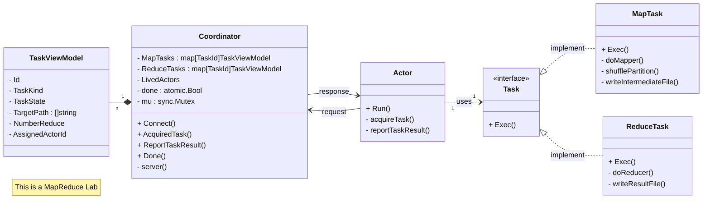
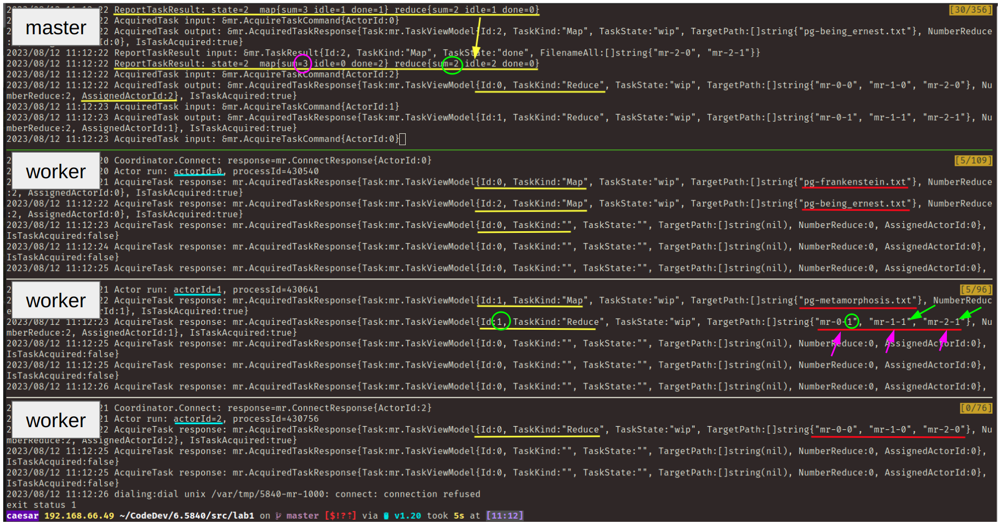
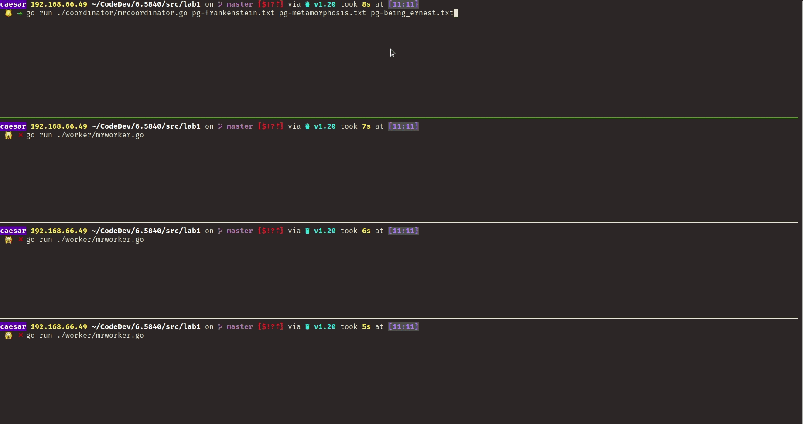

# 6.5840 Lab 1: MapReduce

<https://pdos.csail.mit.edu/6.824/labs/lab-mr.html>

## code design

[implement code](../mr)
- [Coordinator](../mr/coordinator.go#L40)
- [Worker (NewActor)](../mr/worker.go#L26)
- [Actor](../mr/actor.go#L33)
- [MapTask](../mr/task.go#L60)
- [ReduceTask](../mr/task.go#L144)



## demo

```shell
# nMap=3 nReduce=2 worker=3

go run ./coordinator/mrcoordinator.go pg-frankenstein.txt pg-metamorphosis.txt pg-being_ernest.txt                                                                               

go run ./worker/mrworker.go
```





## project layout

```
~/6.5840/src/lab1 $ tree -L 2

├── pg-being_ernest.txt
├── pg-dorian_gray.txt
├── pg-frankenstein.txt
├── pg-grimm.txt
├── pg-huckleberry_finn.txt
├── pg-metamorphosis.txt
├── pg-sherlock_holmes.txt
├── pg-tom_sawyer.txt
├── README.md
├── wc.go
├
├── coordinator
│ └── mrcoordinator.go
├
├── sequential
│ └── mrsequential.go
├
└── worker
  └── mrworker.go
```

```shell
# ~/6.5840/src/lab1
cd ./coordinator
go run mrcoordinator.go ../pg*.txt
```

```shell
# ~/6.5840/src/lab1
cd ./worker
go run mrworker.go 
```

```shell
# ~/6.5840/src/lab1
cd ./sequential
go run mrsequential.go ../pg*.txt
```

## Replace Go plugin

```go
// before
// mapf, reducef := loadPlugin(os.Args[1])

// after
mapf, reducef := lab1.Map, lab1.Reduce
```